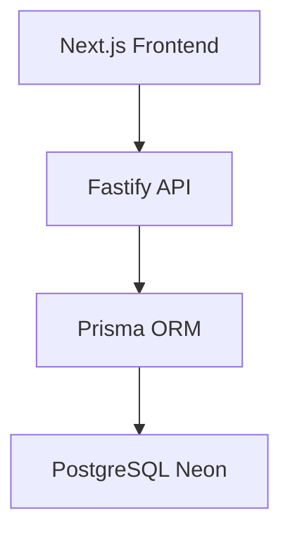

# Calisteni.IA - Backend API

> API REST inteligente para gerenciamento de treinos de calistenia com IA personal trainer integrada.

## Visao do Produto

Calisteni.IA e uma plataforma de treinos focada em **calistenia** (treino com peso corporal) que combina:

- **IA Personal Trainer** — Coach AI que cria planos de treino personalizados, considerando nivel, equipamentos disponiveis e objetivos do usuario
- **Catalogo de Exercicios** — Base de 60+ exercicios de calistenia categorizados por nivel (iniciante/intermediario/avancado), grupo muscular e equipamento necessario
- **Tracking Granular** — Acompanhamento de cada serie individual dentro de uma sessao de treino
- **Metricas de Consistencia** — Streak de treinos, taxa de conclusao e historico de aderencia

## Arquitetura

Diagrama simplificado (visão em camadas):



Visão detalhada:

```
┌─────────────────────────────────────────────────┐
│                   Frontend                       │
│              Next.js 16 (App Router)             │
└──────────────────────┬──────────────────────────┘
                       │ REST + Streaming (AI)
┌──────────────────────▼──────────────────────────┐
│                   Backend API                    │
│                  Fastify 5 + Zod                 │
│                                                  │
│  ┌──────────┐  ┌──────────┐  ┌───────────────┐  │
│  │  Routes   │  │ Usecases │  │  AI (OpenAI)  │  │
│  │          │──▶│          │  │  GPT-4o-mini  │  │
│  └──────────┘  └────┬─────┘  └───────────────┘  │
│                     │                            │
│              ┌──────▼──────┐                     │
│              │   Prisma 7  │                     │
│              └──────┬──────┘                     │
└─────────────────────┼────────────────────────────┘
                      │
               ┌──────▼──────┐
               │  PostgreSQL  │
               │    (Neon)    │
               └──────┬──────┘
                      │
               ┌──────▼──────┐
               │ Better Auth  │
               │   (Google)   │
               └─────────────┘
```

## Stack

| Camada | Tecnologia | Versao |
|--------|-----------|--------|
| Runtime | Node.js | 24+ |
| Framework | Fastify | 5.7 |
| ORM | Prisma | 7.4 |
| Banco de Dados | PostgreSQL (Neon) | - |
| Autenticacao | Better Auth (Google OAuth) | 1.4 |
| IA | OpenAI GPT-4o-mini via AI SDK | 6.0 |
| Validacao | Zod | 4.3 |
| Documentacao | Scalar (OpenAPI) | 1.44 |
| Testes | Vitest | 4.0 |
| Linguagem | TypeScript | 5.9 |

## Endpoints Principais

### Autenticacao (`/api/auth/*`)

| Metodo | Rota | Descricao |
|--------|------|-----------|
| GET/POST | `/api/auth/*` | Better Auth (Google OAuth) |

### Home (`/home`)

| Metodo | Rota | Descricao |
|--------|------|-----------|
| GET | `/home/:date` | Dados do dashboard (treino do dia, streak, consistencia) |

### Perfil (`/me`)

| Metodo | Rota | Descricao |
|--------|------|-----------|
| GET | `/me/` | Dados do usuario (peso, altura, nivel, equipamentos) |
| PUT | `/me/` | Atualizar dados do usuario |

### Estatisticas (`/stats`)

| Metodo | Rota | Descricao |
|--------|------|-----------|
| GET | `/stats/` | Metricas (streak, taxa conclusao, tempo total) |

### Planos de Treino (`/workout-plans`)

| Metodo | Rota | Descricao |
|--------|------|-----------|
| GET | `/workout-plans/` | Listar planos |
| POST | `/workout-plans/` | Criar plano |
| GET | `/workout-plans/:id` | Detalhes do plano |
| GET | `/workout-plans/:id/days/:dayId` | Detalhes do dia + exercicios + sets |
| POST | `/workout-plans/:id/days/:dayId/sessions` | Iniciar sessao de treino |
| PATCH | `/workout-plans/:id/days/:dayId/sessions/:sessionId` | Concluir sessao |
| PATCH | `...sessions/:sessionId/sets/:setId` | Toggle set completo |

### IA Coach (`/ai`)

| Metodo | Rota | Descricao |
|--------|------|-----------|
| POST | `/ai/` | Chat com IA (streaming) — onboarding, criacao de planos, duvidas |

## Modelo de Dados

```
User ──< WorkoutPlan ──< WorkoutDay ──< WorkoutExercise
     ──< WorkoutEvent                    ──< WorkoutSession ──< WorkoutSet

Exercise (catalogo independente com 60+ exercicios)
```

### Principais Entidades

- **User** — dados pessoais, nivel de calistenia, equipamentos disponiveis
- **WorkoutPlan** — plano semanal com 7 dias (MONDAY-SUNDAY)
- **WorkoutDay** — dia de treino ou descanso, com nome, capa e duracao estimada
- **WorkoutExercise** — exercicio com series, reps e tempo de descanso
- **WorkoutSession** — sessao iniciada pelo usuario com horario de inicio/conclusao
- **WorkoutSet** — cada serie individual rastreada (completa/incompleta)
- **Exercise** — catalogo de exercicios com categoria, nivel, grupos musculares e equipamento
- **WorkoutEvent** — eventos de treino (concluido, pulado, gerado) para analytics, metricas e recomendacoes de IA

## Instalacao

```bash
git clone https://github.com/EduardoTorres92/calisteni-ia.git
cd calisteni-ia

pnpm install

cp .env.example .env
```

### Variaveis de Ambiente

| Variavel | Descricao |
|----------|-----------|
| `PORT` | Porta da API (padrao: 3000) |
| `DATABASE_URL` | URL PostgreSQL (Neon ou local) |
| `BETTER_AUTH_SECRET` | Chave secreta para auth (min. 32 chars) |
| `API_BASE_URL` | URL base da API (`http://localhost:3000`) |
| `WEB_APP_BASE_URL` | URL do frontend (`http://localhost:3001`) |
| `GOOGLE_CLIENT_ID` | Client ID do Google OAuth |
| `GOOGLE_CLIENT_SECRET` | Client Secret do Google OAuth |
| `OPENAI_API_KEY` | Chave da API OpenAI |

### Executando

```bash
# Desenvolvimento
pnpm dev

# Testes
pnpm test

# Build
pnpm build

# Seed do catalogo de exercicios
npx prisma db seed
```

### Banco de Dados

```bash
pnpm prisma migrate dev    # Aplicar migracoes
pnpm prisma generate       # Gerar cliente Prisma
pnpm prisma db push        # Push direto (sem migracao)
```

## Documentacao Interativa

Com o servidor rodando, acesse:

- **Swagger UI**: `http://localhost:3000/docs`
- **OpenAPI JSON**: `http://localhost:3000/swagger.json`
- **Healthcheck**: `GET /` retorna status, versao e links

## Fluxo do Usuario

```
1. Login (Google OAuth)
        │
2. Onboarding (chat com IA)
   ├── Dados pessoais (nome, peso, altura, idade, % gordura)
   ├── Nivel de calistenia (iniciante/intermediario/avancado)
   └── Equipamentos disponiveis (barra fixa, paralelas, aneis, etc.)
        │
3. Criacao do Plano (IA seleciona exercicios do catalogo)
   ├── Objetivo (forca, hipertrofia, skills, resistencia)
   ├── Dias por semana (2-6)
   └── Plano de 7 dias gerado automaticamente
        │
4. Treino Diario
   ├── Iniciar sessao
   ├── Marcar sets como completos
   ├── Timer de descanso entre series
   └── Concluir sessao
        │
5. Acompanhamento
   ├── Streak de treinos consecutivos
   ├── Taxa de conclusao
   └── Historico de consistencia
```

## Proximos Passos

- [ ] Emitir eventos (WorkoutCompleted, WorkoutSkipped, WorkoutGenerated) nos use cases para alimentar analytics e IA
- [ ] Historico de evolucao (progressao de reps/carga ao longo do tempo)
- [ ] Notificacoes push para lembrete de treino
- [ ] Modo offline com sincronizacao
- [ ] Exportacao de dados (PDF/CSV)
- [ ] Planos de treino compartilhaveis

## Licenca

ISC
